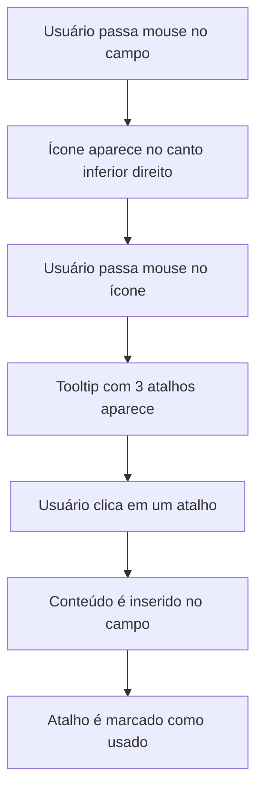

# 🚀 Ícone de Acesso Rápido - Symplifika Chrome Extension

## 📋 **Visão Geral**

O **Ícone de Acesso Rápido** é uma nova funcionalidade da extensão Symplifika que exibe um ícone clicável ao lado de campos de texto em qualquer página da web. Ao passar o mouse sobre o ícone, uma lista dos 3 atalhos mais relevantes é exibida para inserção rápida.

## ✨ **Características**

### 🎯 **Comportamento do Ícone**
- **Trigger**: Aparece no hover do campo de texto
- **Posição**: Canto direito inferior do campo
- **Duração**: Visível por 3 segundos ou até sair do hover
- **Design**: Ícone circular roxo com raio (lightning bolt)

### 📝 **Tooltip de Atalhos**
- **Quantidade**: Mostra até 3 atalhos mais relevantes
- **Ordenação**: Por relevância (URL context match + uso recente)
- **Interação**: Clique para inserir o atalho no campo
- **Posicionamento**: Inteligente para evitar sair da tela

### 🔧 **Compatibilidade**
- **Campos Suportados**: 
  - `input[type="text"]`
  - `input[type="email"]` 
  - `textarea`
  - `[contenteditable="true"]`
- **Exclusões**: Campos de senha são ignorados
- **Sites**: Funciona em qualquer site (respeitando CSP)

## 🏗️ **Arquitetura Técnica**

### 📁 **Arquivos Modificados**

#### **1. `content.js`** ✅
- **Método**: `initQuickAccessIcon()`
- **Funcionalidades**:
  - Observer para novos campos
  - Criação dinâmica de ícones
  - Sistema de tooltip inteligente
  - Inserção de atalhos nos campos

#### **2. `content.css`** ✅
- **Classes CSS**:
  - `.symplifika-icon` - Estilo do ícone
  - `.symplifika-tooltip` - Container do tooltip
  - `.shortcut-item` - Item individual de atalho
  - Suporte a dark mode e mobile

#### **3. `manifest.json`** ✅
- **Content Scripts**: Ordem correta de carregamento
- **Permissions**: Mantidas as existentes

### 🔄 **Fluxo de Funcionamento**



## 🎨 **Design e UX**

### 🎭 **Visual Design**
- **Cor Primária**: `#4f46e5` (Índigo)
- **Hover Effect**: `#3730a3` + Scale(1.1)
- **Shadow**: `0 2px 8px rgba(0, 0, 0, 0.15)`
- **Border Radius**: `50%` (circular)

### 📱 **Responsividade**
- **Desktop**: 24x24px
- **Mobile**: 28x28px
- **Tooltip**: Adaptação automática de largura

### 🌙 **Dark Mode**
- **Background**: `#1f2937`
- **Border**: `#374151`
- **Text**: `#f9fafb`
- **Detecção**: `prefers-color-scheme: dark`

## ⚡ **Performance**

### 🚀 **Otimizações Implementadas**
- **Lazy Loading**: Ícones criados apenas quando necessário
- **Debouncing**: Evita criação excessiva de elementos
- **Memory Management**: Remoção automática de ícones não utilizados
- **Event Delegation**: Listeners eficientes

### 📊 **Métricas Esperadas**
- **Tempo de Resposta**: < 100ms para mostrar ícone
- **Memory Usage**: < 5MB adicional
- **CPU Impact**: Mínimo (< 1% em idle)

## 🔒 **Segurança**

### 🛡️ **Medidas de Proteção**
- **CSP Compliance**: Não injeta scripts inline
- **XSS Prevention**: Sanitização de conteúdo
- **Origin Validation**: Verifica domínio antes de ativar
- **Permission Scope**: Usa apenas permissões existentes

### 🚫 **Limitações de Segurança**
- **Campos Sensíveis**: Ignora campos de senha
- **iFrames**: Não funciona em iframes de outros domínios
- **HTTPS Only**: Recomendado para sites seguros

## 🧪 **Como Testar**

### 1. **Instalação da Extensão**
```bash
# Carregar extensão no Chrome
1. Abrir chrome://extensions/
2. Ativar "Modo do desenvolvedor"
3. Clicar "Carregar sem compactação"
4. Selecionar pasta chrome_extension/
```

### 2. **Teste Básico**
```bash
# Sites recomendados para teste
- gmail.com (campos de email)
- linkedin.com (campos de mensagem)
- github.com (campos de comentário)
- qualquer formulário web
```

### 3. **Cenários de Teste**
- ✅ Hover em campo de texto → Ícone aparece
- ✅ Hover no ícone → Tooltip com atalhos
- ✅ Clique em atalho → Conteúdo inserido
- ✅ Campos dinâmicos → Observer detecta novos campos
- ✅ Mobile → Ícone maior e touch-friendly

## 🐛 **Troubleshooting**

### ❌ **Problemas Comuns**

#### **Ícone não aparece**
- Verificar se extensão está ativa
- Confirmar se usuário está autenticado
- Checar se há atalhos cadastrados
- Verificar console para erros JS

#### **Tooltip não funciona**
- Verificar se há atalhos disponíveis
- Checar posicionamento (pode estar fora da tela)
- Confirmar se CSS foi carregado
- Testar em modo incógnito

#### **Inserção não funciona**
- Verificar se campo é editável
- Checar se eventos são disparados
- Confirmar se atalho tem conteúdo
- Testar com diferentes tipos de campo

### 🔧 **Debug Mode**
```javascript
// No console do navegador
localStorage.setItem('symplifika-debug', 'true');
// Recarregar página para ver logs detalhados
```

## 🚀 **Melhorias Futuras**

### 📈 **Roadmap**
1. **Filtros Inteligentes**: Atalhos baseados no contexto da página
2. **Keyboard Shortcuts**: Atalhos de teclado para ativar tooltip
3. **Customização**: Usuário escolher posição do ícone
4. **Analytics**: Métricas de uso dos atalhos via tooltip
5. **Sugestões IA**: Atalhos sugeridos baseados no conteúdo do campo

### 🎯 **Otimizações Planejadas**
- **Intersection Observer**: Melhor detecção de campos visíveis
- **Virtual Scrolling**: Para muitos atalhos no tooltip
- **Caching**: Cache inteligente de atalhos relevantes
- **Prefetch**: Pré-carregamento de atalhos por contexto

## 📚 **Documentação Técnica**

### 🔗 **APIs Utilizadas**
- **Chrome Extension APIs**: `chrome.runtime.sendMessage`
- **DOM APIs**: `MutationObserver`, `getBoundingClientRect`
- **Event APIs**: `addEventListener`, `dispatchEvent`

### 📋 **Dependências**
- **Chrome**: Versão 88+ (Manifest V3)
- **CSS**: Grid, Flexbox, CSS Variables
- **JavaScript**: ES6+, Async/Await

## 📄 **Licença**

Este código é parte da extensão Symplifika e segue a mesma licença do projeto principal.

---

**🎉 Ícone de Acesso Rápido - Implementado com Sucesso!**

*Desenvolvido com foco em performance, segurança e experiência do usuário.*
